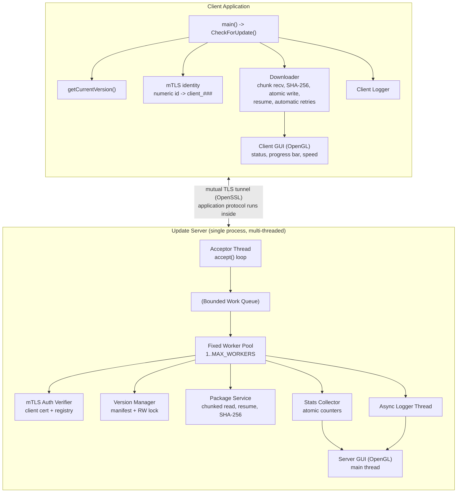
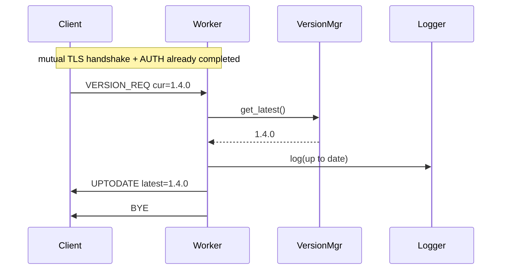
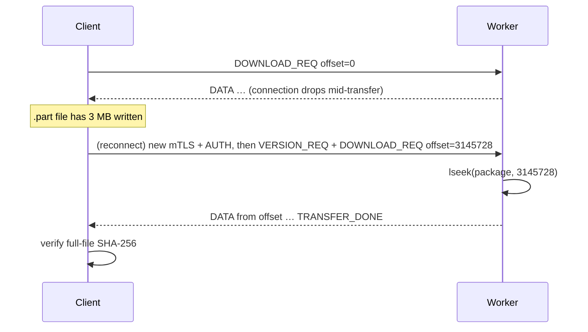
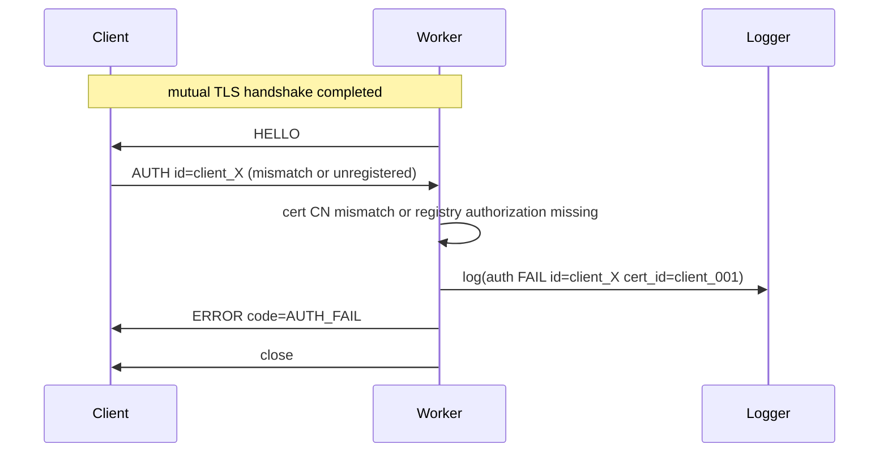
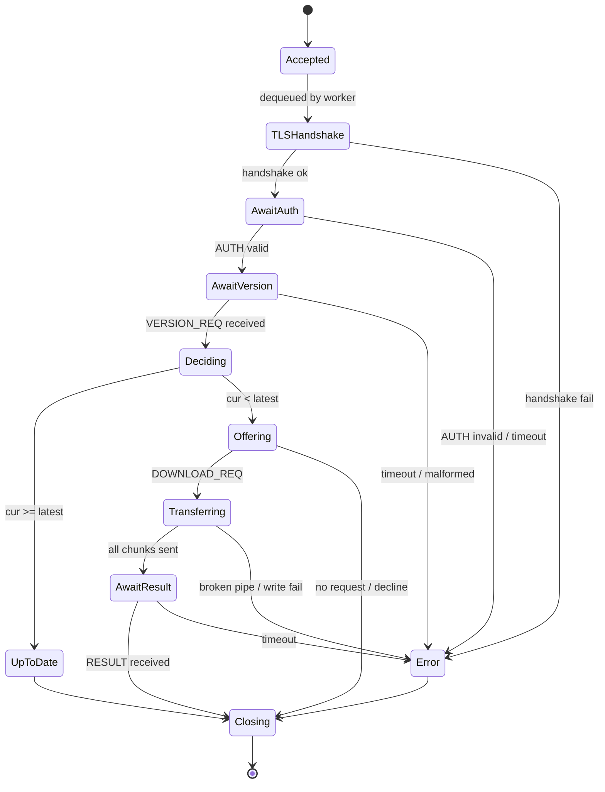
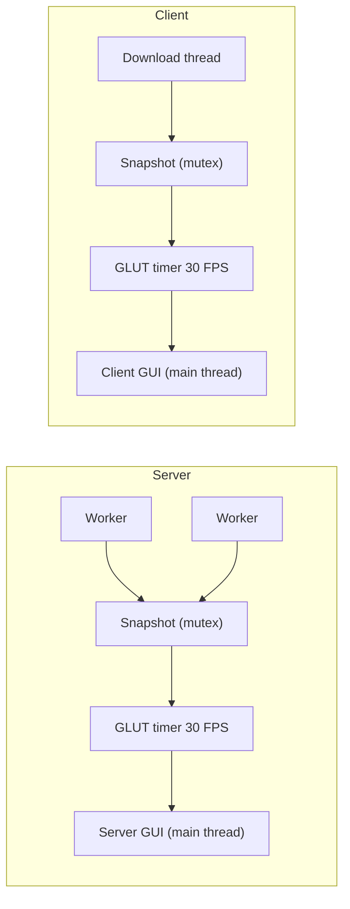

# Distributed Software Update Framework — System Design & Architecture

**Course:** ENCS4330 — Real-Time Applications & Embedded Systems
**Project:** #3 — Sockets & POSIX Threads under Linux
**Document:** Design specification (architecture, protocol, concurrency, security, data flow)

---

## 1. Overview

The system is a client/server **software update service**. Client applications report the version they currently run; a centralized, multi-threaded server decides whether a newer version exists and, if so, streams the update package to the client. The headline non-functional requirement is **concurrency**: many clients must be served at the same time with no client blocking another.

This document specifies the architecture before any code is written. It fixes the concurrency model, the wire protocol, the synchronization strategy, the security model, the configuration scheme, the failure handling, and the visualization, so that the implementation is a translation of decisions already made rather than a sequence of improvisations.

### 1.1 Design objectives

The design is steered by seven objectives, in priority order:

1. **Correctness under concurrency** — no race conditions on shared state, no corrupted downloads, deterministic version decisions.
2. **Scalable concurrency** — serve N simultaneous clients with bounded, predictable resource usage.
3. **Security** — encrypted transport and authenticated clients; the system must resist eavesdropping, tampering, and unauthorized update requests.
4. **Reliability** — survive client disconnects, slow clients, partial transfers, and bad input without crashing.
5. **Observability** — every meaningful event is logged with timestamp, thread, client, and outcome; live state is visualized for both server and client.
6. **Configurability** — no magic numbers in code; all tunables come from a config file passed as an argument.
7. **Clarity of justification** — every non-obvious choice has a stated reason, because the project asks us to defend our choices.

### 1.2 Explicit non-goals

Actual installation of software is **simulated** (the spec permits this). The transferred package is treated as an opaque binary blob; the client stores it and optionally "executes" it by printing a simulated install step. We do not implement a real package manager or OS integration layer. The project does include a local demonstration CA so mutual TLS can authenticate both server and pre-registered clients.

---

## 2. Key Design Decisions (and why)

The project explicitly asks us to "be wise in the choices you make and be ready to convince us." This section is that defense, gathered up front.

| # | Decision | Choice | Rationale |
|---|----------|--------|-----------|
| D1 | Transport protocol | **TCP** | Updates must arrive complete, ordered, and uncorrupted. UDP would force us to re-implement reliability, ordering, and flow control — exactly what TCP already gives us. File integrity is non-negotiable. |
| D2 | Concurrency model | **Fixed bounded thread pool + dedicated acceptor thread** | A fixed set of worker threads (count from config), each owning one active client session. Predictable resource ceiling, no per-connection thread-creation cost. An *elastic* core→max pool was considered and **rejected** — see §2.1. |
| D3 | I/O model | **Blocking I/O on pooled threads** | Matches the socket + pthread techniques from class, keeps per-connection logic linear and readable. An `epoll` event loop is more scalable but harder to reason about and unnecessary at this scale; noted as an alternative in §2.2. |
| D4 | Message framing | **Fixed binary header + typed payload** | TCP is a byte stream, not a message stream. A length-prefixed header makes message boundaries explicit and lets control messages (text) and data (binary) share one channel. See §5. |
| D5 | File transfer + integrity | **Chunked streaming + whole-file SHA-256 verified at the end + atomic write** | Large files must not be buffered whole in memory. After the final chunk, the client verifies the whole-file **SHA-256** against the value the server advertised; only on a match does it atomically rename the file into place. See §5 and §11. |
| D6 | Logging | **Asynchronous logger thread** | Worker threads must never block on disk I/O. They enqueue log records; a single logger thread serializes writes. This also makes the log file inherently race-free without a lock on every line. |
| D7 | Version store | **Manifest file behind a read–write lock** | Reads are frequent (every client), writes are rare (release a new version). A `pthread_rwlock_t` lets all workers read concurrently and supports hot-reload on `SIGHUP` without restarting the server. |
| D8 | Configuration | **Key=value text file as `argv[1]`** | Required by the spec. Lets us change ports, worker counts, paths, versions, registry paths, and certificate paths without recompiling. |
| D9 | Visualization | **OpenGL/GLUT GUI on the main thread, reading a mutex-guarded snapshot — on both server and client** | OpenGL contexts are single-threaded; rendering stays on the thread that owns the context while worker/network threads publish state into a shared snapshot. See §12. |
| D10 | Transport security | **TLS via OpenSSL with authenticated session keys** | Confidentiality, in-transit integrity, server authentication, and forward secrecy from a battle-tested library. TLS negotiates ephemeral session keys that encrypt/authenticate every protocol frame. See §10.2. |
| D11 | Client authentication | **Mutual TLS client certificates plus registry authorization** | Clients are pre-registered. Each client owns a CA-signed certificate/private key; the server verifies the certificate during the TLS handshake, extracts the certificate identity, and authorizes it against `clients.keys`. See §10.3. |
| D12 | Overload policy | **Explicit rejection (`ERROR code=BUSY`) + client backoff with jitter** | When the worker pool and queue are saturated, the server tells the client *why* and closes, instead of silently dropping or blocking indefinitely. The client retries with exponential backoff + jitter. See §11.4. |
| D13 | Idle-worker wait | **`pthread_cond_wait` on the work queue** | Idle workers sleep at zero CPU cost until signaled, instead of busy-waiting (spinning). See §7.2. |

### 2.1 Fixed pool vs. elastic (core→max) pool

The spec says "create a separate thread for each connected client" and "no client should wait for another." We satisfy this with a **fixed bounded thread pool**: a dedicated acceptor thread enqueues accepted connections, and a fixed set of `MAX_WORKERS` worker threads each run one full client session to completion. While a client is connected and active, it is owned by a dedicated worker, and up to `MAX_WORKERS` clients run truly in parallel with no client waiting on another.

We explicitly **rejected** the elastic *core→max* model (a small fixed core that grows new threads up to a ceiling under load, e.g. Java's `ThreadPoolExecutor`). That pattern is real and used in production, but it adds idle-thread reaping, growth/shrink synchronization, and — worst of all — it creates threads *exactly when the system is already under stress*. A fixed pool gives a predictable resource ceiling and is far simpler to prove correct. Concurrency is intentionally capped at `MAX_WORKERS` (tunable); beyond that, the overload policy in §11.4 applies.

> Honest tradeoff: true simultaneity is bounded by `MAX_WORKERS` (and ultimately CPU cores). This is the correct, realistic behavior — unbounded parallelism is a bug, not a feature.

### 2.2 Why not `epoll`/event-driven?

An `epoll` reactor with a small thread pool scales to tens of thousands of connections on one box. We deliberately do **not** use it here because (a) the course's stated techniques are sockets + POSIX threads, (b) blocking-per-thread logic is far easier to read and defend, and (c) the expected load (a classroom demo of concurrent clients) is comfortably handled by a pool of a few dozen threads. We document this as the natural next step if the system needed to scale.

---

## 3. High-Level Architecture



**Component responsibilities (server):**

- **Acceptor thread** — owns the listening socket, accepts TCP connections, enqueues client sockets. Does no per-client work (not even the TLS handshake), so it never stalls.
- **Work queue** — bounded, thread-safe FIFO decoupling acceptance rate from service rate.
- **Worker pool** — each worker performs the TLS handshake, authenticates the client, then runs one full session: version check → decision → optional transfer → close.
- **Auth Verifier** — verifies the TLS client certificate identity and authorizes it through the registered-client table (§10.3).
- **Version Manager** — single source of truth for the latest version + package metadata, guarded by a read–write lock, hot-reloadable.
- **Package Service** — opens and reads package files in chunks; supports seeking to an offset for resume; computes/serves the SHA-256 digest.
- **Async Logger** — owns the log file; consumes log records from a queue and writes them in order.
- **Stats Collector** — atomic counters (connections, active transfers, bytes sent, errors, auth failures) feeding the server GUI.
- **Server GUI** — runs on the main thread, reads a periodic snapshot of stats/logs, renders simple meters and a log ticker.

**Client components:** `CheckForUpdate()` orchestrates the session; `getCurrentVersion()` reads the installed version row for the normalized client ID; the Auth step presents the normalized ID after mTLS proves certificate ownership; the Downloader handles chunked receipt, SHA-256 verification, atomic file placement, resume, and automatic retries; a logger records the client side; the **Client GUI** shows connection status, current vs. available version, a download progress bar, and transfer speed.

---

## 4. Server Internal Design

### 4.1 Startup sequence

1. Parse `argv[1]` as the server config path; load all tunables (§9).
2. Install signal handlers: ignore `SIGPIPE`; catch `SIGINT`/`SIGTERM` for graceful shutdown; catch `SIGHUP` for manifest reload.
3. Initialize OpenSSL, create the server `SSL_CTX`, load the server certificate/private key, load `CA_CERT`, and require client certificates (§10.2).
4. Load the registered-client authorization table path (§10.3).
5. Load the version manifest into the Version Manager.
6. Start the async logger thread.
7. Create the listening socket: `socket()` → `setsockopt(SO_REUSEADDR)` → `bind()` → `listen(backlog)`.
8. Initialize the work queue and spawn `MAX_WORKERS` worker threads.
9. Spawn the acceptor thread.
10. Initialize OpenGL/GLUT and enter the render loop on the main thread.

### 4.2 Acceptor thread

```
loop while running:
    client_fd = accept(listen_fd, &addr)   # blocking
    if client_fd < 0:
        if EINTR and shutting_down: break
        else log error, continue
    set per-client timeouts (SO_RCVTIMEO / SO_SNDTIMEO)
    log("connection accepted", addr, fd)
    if not queue_push(client_fd):           # queue full -> explicit rejection (D12)
        plain-TCP send BUSY notice, close(client_fd), log("rejected: server busy")
```

The acceptor never performs the TLS handshake or reads client data, so a slow client (or a slow TLS negotiation) can never stall acceptance of new connections.

### 4.3 Worker thread lifecycle

Each worker is an infinite loop that blocks on the queue with `pthread_cond_wait` (D13), then performs the TLS handshake, authenticates, and runs the per-connection state machine (§8.1) to completion:

```
loop while running:
    client_fd = queue_pop()            # blocks on pthread_cond_wait until work or shutdown
    if shutdown_sentinel: break
    ssl = tls_accept(client_fd)        # TLS handshake done HERE, not in acceptor
    if ssl == NULL: log(tls_fail), close(client_fd), continue
    if not authenticate(ssl):          # verify client cert CN, AUTH id, and registry row
        send ERROR{AUTH_FAIL}, tls_close(ssl), close(client_fd), continue
    handle_client(ssl)                 # full session, see §8.1
    tls_close(ssl); close(client_fd)
```

`handle_client` is linear and readable precisely because the thread is dedicated to this one client for the duration of the call. All shared access (version manifest, logger, stats) goes through the synchronization primitives in §7.

### 4.4 Version Manager

Holds the current `VersionManifest { latest_version, package_file, sha256, release_notes, min_supported }`. Workers call `vm_get_latest()` under a **read lock**; a `SIGHUP` handler (or admin trigger) calls `vm_reload()` under a **write lock**. The decision logic compares versions semantically (§5.4), never as strings.

### 4.5 Package Service

Given a package file and an offset, it streams chunks of `CHUNK_SIZE` bytes using a read→`SSL_write` loop with partial-send handling. It never `malloc`s the whole file. For the checksum it streams the file once at load time and caches the SHA-256 digest in the manifest (so it is not recomputed per client). Resume is supported by `lseek()`/`pread()` to the requested offset.

---

## 5. Application Protocol Specification

> The entire application protocol below runs **inside the TLS tunnel** (§10.2). Framing, control messages, authentication, and file chunks are all encrypted transparently by OpenSSL; `recv_all`/`send_all` are implemented over `SSL_read`/`SSL_write`.

### 5.1 Why a framed protocol

TLS (like TCP) delivers a byte stream with no message boundaries: one `SSL_read()` may return half a message or one-and-a-half messages. We impose structure with a fixed-size header that always precedes a payload of declared length. Every read uses a `recv_all()` helper that loops until the full requested length is received, and every write uses `send_all()` (handling partial sends).

### 5.2 Frame header (12 bytes, network byte order)

| Field | Size | Meaning |
|-------|------|---------|
| `magic` | 4 B | `0x55 0x50 0x44 0x54` ("UPDT") — detects desync/garbage |
| `proto_version` | 1 B | protocol version (currently 1) |
| `msg_type` | 1 B | message type (see §5.3) |
| `flags` | 1 B | bit flags (e.g. LAST_CHUNK) |
| `reserved` | 1 B | alignment / future use |
| `payload_len` | 4 B | length of the payload that follows |

Control messages carry a small **text** payload of `key=value;` pairs (easy to parse and to read in logs). DATA messages carry a **binary** chunk.

### 5.3 Message types

| Type | Direction | Payload | Purpose |
|------|-----------|---------|---------|
| `HELLO` | S → C | `srv=updctl;proto=1` | Server ready, advertises protocol version |
| `AUTH` | C -> S | `id=client_001` | Client binds its requested identity to the TLS client certificate identity (Section 10.3) |
| `AUTH_OK` | S → C | — | Authentication accepted, may proceed |
| `VERSION_REQ` | C → S | `cur=1.2.0` | Client reports its installed version |
| `UPTODATE` | S → C | `latest=1.2.0` | No update needed |
| `UPDATE_AVAILABLE` | S → C | `ver=1.4.0;size=...;chunk=65536;chunks=...;sha256=...` | Update offered with metadata |
| `DOWNLOAD_REQ` | C → S | `offset=0` | Client requests transfer (offset enables resume) |
| `DATA` | S → C | binary chunk bytes | One file chunk; `flags=LAST_CHUNK` on the final one |
| `TRANSFER_DONE` | S → C | `sha256=...` | Transfer finished, authoritative whole-file digest |
| `RESULT` | C → S | `status=ok` / `status=checksum_fail` | Client reports outcome |
| `ERROR` | S↔C | `code=...;msg=...` | Structured error (see §11.5) |
| `BYE` | S↔C | — | Graceful close |

### 5.4 Versioning scheme

Versions are **semantic**: `MAJOR.MINOR.PATCH`. Comparison is field-by-field, numeric. `cur < latest` ⇒ update available. The manifest also stores `min_supported`; a client below it can be told to do a full reinstall rather than an incremental update (extension hook).

### 5.5 Example exchange (update available)

```
[TCP connect -> mutual TLS handshake: client validates server cert, server validates client cert, session keys established]
S → C : HELLO {srv=updctl;proto=1}
C → S : AUTH {id=client_001}
S → C : AUTH_OK
C → S : VERSION_REQ {cur=1.2.0}
S → C : UPDATE_AVAILABLE {ver=1.4.0;size=10485760;chunk=65536;chunks=160;sha256=cd34…}
C → S : DOWNLOAD_REQ {offset=0}
S → C : DATA [chunk 1] … DATA [chunk 160, flags=LAST_CHUNK]
S → C : TRANSFER_DONE {sha256=cd34…}
C     : verify whole-file SHA-256, then rename app-1.4.0.bin.part → app-1.4.0.bin
C → S : RESULT {status=ok}
S → C : BYE
```

---

## 6. Sequence Diagrams

### 6.1 Update available (with TLS + auth)

```mermaid
sequenceDiagram
    participant C as Client
    participant A as Acceptor
    participant W as Worker
    participant V as VersionMgr
    participant F as PackageSvc
    participant L as Logger
    C->>A: TCP connect
    A->>L: log(accepted)
    A->>W: enqueue(client_fd)
    C->>W: mutual TLS handshake
    W-->>C: server cert verified; client cert verified; session keys ready
    W->>C: HELLO
    C->>W: AUTH id=client_001
    W->>W: compare AUTH id with client cert CN; check registry
    W->>L: log(auth ok client_001)
    W->>C: AUTH_OK
    C->>W: VERSION_REQ cur=1.2.0
    W->>V: get_latest() (read lock)
    V-->>W: 1.4.0 + sha256
    W->>C: UPDATE_AVAILABLE meta
    C->>W: DOWNLOAD_REQ offset=0
    loop chunks
        F-->>W: read chunk
        W->>C: DATA chunk (encrypted)
    end
    W->>C: TRANSFER_DONE sha256
    C->>C: verify SHA-256 + atomic rename
    C->>W: RESULT ok
    W->>L: log(transfer complete)
    W->>C: BYE
```

### 6.2 Already up to date



### 6.3 Interrupted transfer with resume



Note: resume is for surviving a **connection loss** only. Within a single live TLS/TCP connection, retransmission and ordering are already guaranteed by the transport — the application never re-sends an offset on a connection that is still up. The offset is sent on a *new* connection after a drop.

### 6.4 Authentication failure



---

## 7. Concurrency & Synchronization

### 7.1 Shared resources and their guards

| Shared resource | Primitive | Why |
|-----------------|-----------|-----|
| Work queue (acceptor → workers) | `pthread_mutex_t` + `cond_not_empty` + `cond_not_full` | Classic bounded producer/consumer; condvars avoid busy-waiting and provide backpressure |
| Version manifest | `pthread_rwlock_t` | Many concurrent readers (every client), rare writer (reload) |
| Log record queue | `pthread_mutex_t` + `cond_not_empty` | Workers enqueue without blocking on disk; logger thread drains in order |
| Stats counters | C11 `_Atomic` / `__atomic` builtins | Lock-free increments for hot-path counters |
| GUI snapshot (server & client) | `pthread_mutex_t` (held briefly) | Render thread copies state out under lock, then renders unlocked |
| Master secret `S` | read-only after load | Loaded once at startup; never mutated, so no lock needed |

### 7.2 Bounded work queue (producer/consumer)

```
push(fd):
    lock(m)
    if queue full: return false        # explicit rejection (D12), acceptor handles BUSY
    enqueue(fd); signal(cond_not_empty)
    unlock(m)

pop():
    lock(m)
    while queue empty and running: pthread_cond_wait(cond_not_empty, m)   # D13: sleep, no spin
    fd = dequeue(); signal(cond_not_full)
    unlock(m)
    return fd
```

Idle workers consume **zero CPU** while parked in `pthread_cond_wait`; the alternative — spinning on a check — would burn a core for nothing. The predicate is always re-checked in a `while` loop to handle spurious wakeups, and a shutdown sentinel wakes parked workers so they can exit.

### 7.3 Asynchronous logging

Workers build a log record (timestamp, thread id, client addr, level, event) and push it to the log queue — an O(1) operation that does not block on disk. A single logger thread pops records and writes them, so the file is written by exactly one thread and never interleaves partial lines. On shutdown the queue is drained before the thread exits (no lost logs).

### 7.4 Deadlock and race avoidance

- **Lock ordering:** the few locks are never nested. A worker never holds the queue lock while taking the manifest lock, etc. No lock is held across blocking socket/TLS I/O.
- **Short critical sections:** locks guard only the in-memory mutation, never network or disk operations.
- **`SIGPIPE` ignored:** writing to a socket the peer closed returns an error instead of killing the process; alternatively `MSG_NOSIGNAL`/OpenSSL error returns.
- **No shared client buffers:** each worker owns its own stack buffers and its own `SSL*` for its client, so there is no cross-client data to race on.
- **Atomic shutdown flag:** a `volatile sig_atomic_t` set by the signal handler; threads check it at loop boundaries.

---

## 8. State Machines

### 8.1 Server per-connection FSM



### 8.2 Client FSM

```mermaid
stateDiagram-v2
    [*] --> Connecting
    Connecting --> TLSHandshake: TCP connected
    Connecting --> Retry: connect failed
    TLSHandshake --> Authenticating: session established
    TLSHandshake --> Retry: handshake / cert fail
    Authenticating --> SendVersion: AUTH_OK
    Authenticating --> Failed: AUTH_FAIL
    SendVersion --> AwaitDecision
    AwaitDecision --> Done: UPTODATE
    AwaitDecision --> Downloading: UPDATE_AVAILABLE -> DOWNLOAD_REQ
    Downloading --> Verifying: TRANSFER_DONE
    Downloading --> Retry: connection lost
    Verifying --> Done: SHA-256 ok -> atomic rename
    Verifying --> Retry: checksum fail
    Retry --> Connecting: backoff + jitter, attempts < max
    Retry --> Failed: attempts exhausted
    Done --> [*]
    Failed --> [*]
```



---

## 9. Configuration Files

All tunables live in plain `KEY=VALUE` text files passed as `argv[1]`. No value is hard-coded in source.

**`server.conf`**
```ini
PORT=5500
MAX_WORKERS=16
ACCEPT_BACKLOG=64
QUEUE_CAPACITY=128
MANIFEST_PATH=./config/manifest.conf
PACKAGE_DIR=./packages
LOG_FILE=./logs/server.log
LOG_LEVEL=INFO
CHUNK_SIZE=65536
CLIENT_TIMEOUT_SEC=30
PAUSE_HOLD_TIMEOUT_SEC=5
# --- security ---
TLS_CERT=./config/server.crt
TLS_KEY=./config/server.key
CA_CERT=./config/ca.crt
CLIENT_REGISTRY=./config/clients.keys         ; authorization registry after mTLS auth
```

**`manifest.conf`** (the version "database"; reloadable on SIGHUP)
```ini
LATEST_VERSION=1.4.0
PACKAGE_FILE=app-1.4.0.bin
CHECKSUM_SHA256=cd34ef56…
MIN_SUPPORTED=1.0.0
RELEASE_NOTES=Security patches and performance improvements
```

**`client.conf`**
```ini
SERVER_HOST=127.0.0.1
SERVER_PORT=5500
CLIENT_VERSION_FILE=./config/client_versions.txt
CLIENT_REGISTRY=./config/clients.keys
CLIENT_DATA_DIR=./clients
DOWNLOAD_DIR=
RETRY_MAX=5
RETRY_BACKOFF_MS=500
TIMEOUT_SEC=30
PAUSE_TIMEOUT_SEC=30
LOG_FILE=
# --- security ---
SERVER_CA=./config/ca.crt                     ; trusted CA that signed server/client certs
SERVER_TLS_NAME=update-server                 ; expected server certificate identity
CLIENT_ID=001                                 ; normalized to client_001
CLIENT_CERT=./config/clients/client_001.crt
CLIENT_KEY=./config/clients/client_001.key
```

`getCurrentVersion()` reads the row for the normalized `client_###` identity in `CLIENT_VERSION_FILE` (or `CURRENT_VERSION` if set inline), making it practical to simulate many clients in parallel.

---

## 10. Security: Encryption & Authentication

### 10.1 Goals

The system must (a) keep traffic confidential and tamper-evident in transit, (b) let the client trust that it is talking to the real update server, and (c) let the server accept update requests only from pre-registered clients. Mutual TLS covers encryption plus both sides of identity authentication; the client registry is used after authentication for authorization.

### 10.2 Encryption — TLS session protection

Every connection is wrapped in **TLS via OpenSSL**. The TLS handshake performs a hybrid scheme automatically: an asymmetric authenticated key exchange negotiates ephemeral symmetric session keys, then every application frame is carried as encrypted TLS records. Modern negotiated TLS record protection uses authenticated encryption such as AES-GCM or ChaCha20-Poly1305, so each record is confidential, tamper-evident, ordered, and bound to this TLS session.

- The project CA signs the server certificate and every client certificate.
- The server loads `TLS_CERT`, `TLS_KEY`, and `CA_CERT` into an `SSL_CTX`.
- The client loads `SERVER_CA`, `CLIENT_CERT`, and `CLIENT_KEY`; it also verifies `SERVER_TLS_NAME` against the server certificate.
- The **TLS handshake runs in the worker thread**, not the acceptor (§4.3), so handshake cost and round-trips never stall connection acceptance.
- The application protocol (§5) is unchanged — it simply runs inside the tunnel, with `recv_all`/`send_all` implemented over `SSL_read`/`SSL_write`.
- TLS record authentication detects in-transit tampering of every record; this is in addition to the end-to-end whole-file SHA-256 (§11.2), which protects the artifact on disk regardless of transport.

### 10.3 Authentication — mutual TLS

Clients are **pre-registered**. During provisioning, each client receives a unique private key and certificate signed by the project CA:

1. Client input `1`, `01`, or `001` normalizes to canonical ID `client_001`.
2. The client loads `config/clients/client_001.crt` and `config/clients/client_001.key`.
3. The TLS handshake sends the client certificate to the server. The private key is never sent; the client proves possession of it cryptographically during the handshake.
4. The server requires a peer certificate with `SSL_VERIFY_PEER | SSL_VERIFY_FAIL_IF_NO_PEER_CERT` and verifies it using `CA_CERT`.
5. After TLS succeeds, the server extracts the certificate common name, for example `client_001`.
6. The client sends `AUTH { id=client_001 }` inside the encrypted channel. The server accepts only if the claimed ID equals the certificate identity and that ID appears in `CLIENT_REGISTRY`.

This separates authentication from authorization. The TLS certificate authenticates who the peer is. `CLIENT_REGISTRY` answers whether that authenticated identity is allowed to use this update service. Removing a row revokes authorization even if the certificate still chains to the CA.

### 10.4 Key provisioning

Provisioning happens **once, out-of-band, before the client's first update request**:

1. Generate a CA key/certificate: `ca.key`, `ca.crt`.
2. Generate server key/certificate signed by the CA: `server.key`, `server.crt`.
3. Generate one key/certificate per client, signed by the same CA: `client_001.key`, `client_001.crt`, etc.
4. Install `ca.crt` on both sides as trust anchor.
5. Keep `ca.key`, `server.key`, and each `client_###.key` secret. These private keys are never transmitted.
6. Store allowed client IDs in `CLIENT_REGISTRY`.

Certificate rotation is done by issuing a new certificate/key pair and updating the relevant config. Authorization revocation is done by removing the ID from `CLIENT_REGISTRY`.

### 10.5 What crosses the wire (defense view)

| Value | On the wire | Risk if observed |
|-------|-------------|------------------|
| CA private key `ca.key` | **Never transmitted** | catastrophic if leaked; attacker can issue trusted certs |
| Server private key `server.key` | **Never transmitted** | attacker may impersonate server until cert/key rotation |
| Client private key `client_001.key` | **Never transmitted** | attacker may impersonate that client until revocation/rotation |
| Certificates (`*.crt`) | Sent during TLS handshake | public identity documents; safe to observe |
| `id` | Inside TLS | harmless alone; must match authenticated certificate identity |
| Package bytes | Inside TLS record encryption | network observer sees only ciphertext |

For the defense: "What if someone sniffs the connection?" -> they capture only TLS ciphertext and public certificates. "What if someone injects packets after authentication?" -> TLS record authentication rejects packets that do not have valid session keys and record tags. "What if a client key leaks?" -> remove that client from `CLIENT_REGISTRY` and issue a new certificate/key pair.

---

## 11. Reliability & Error Handling

### 11.1 Timeouts

Every client socket gets `SO_RCVTIMEO`/`SO_SNDTIMEO` from `CLIENT_TIMEOUT_SEC`, plus a TLS-handshake timeout. A client that connects and goes silent cannot hold a worker hostage; the worker times out, logs it, closes, and returns to the pool.

### 11.2 Atomic, never-corrupt downloads + SHA-256

The client writes incoming chunks to `<name>.part`. After `TRANSFER_DONE`, it computes the **whole-file SHA-256** of `.part` and compares it to the digest the server advertised. Only on a match does it `rename()` to the final name — an atomic operation on the same filesystem. A crash or disconnect mid-transfer leaves a `.part` file, never a corrupt "installed" binary. This end-to-end check protects against disk corruption, memory errors, and code bugs that TLS/TCP cannot see.

### 11.3 Partial transfer recovery (resume)

On reconnect, the client sends `DOWNLOAD_REQ offset=<bytes already in .part>`; the server seeks and continues. The request also carries the version, which the server validates — if the latest package changed between attempts, the offset is invalid and the client restarts from 0. The final whole-file SHA-256 protects against any mismatch.

### 11.4 Overload policy — explicit rejection

When all workers are busy and the queue is full, the server does **not** block the client or silently drop it. The acceptor replies with a `BUSY` notice and closes (D12). The client treats `BUSY` as a retryable condition and backs off with **exponential backoff + jitter** (the jitter prevents a thundering herd of synchronized retries). This keeps the server alive under overload rather than thrashing or exhausting memory.

### 11.5 Error taxonomy

| Code | Meaning | Server action | Client action |
|------|---------|---------------|---------------|
| `BUSY` | Pool/queue saturated | Reject, log | Retry w/ backoff + jitter |
| `AUTH_FAIL` | Certificate identity mismatch or unregistered client id | Send ERROR, close, log identity only | Stop; report credential problem |
| `TLS_FAIL` | Handshake / cert failure | Close, log | Retry or report cert problem |
| `BAD_REQUEST` | Malformed/unknown message | Send ERROR, close | Log, fail |
| `BAD_VERSION` | Unparseable version string | Send ERROR, close | Log, fail |
| `NO_PACKAGE` | Manifest references missing file | Send ERROR, log, close | Log, fail |
| `CHECKSUM_FAIL` | Client-side SHA-256 mismatch | — | Discard .part, retry |
| `TIMEOUT` | No data within window | Close, log | Retry w/ backoff |
| `IO_ERROR` | Socket/file error | Close, log | Retry w/ backoff |

### 11.6 General robustness

Every syscall and OpenSSL return is checked. `EINTR` is handled (retry or break on shutdown). The server is expected to run indefinitely; no single client's misbehavior can crash it. The client retries with exponential backoff up to `RETRY_MAX`, then reports failure cleanly.

---

## 12. Monitoring, Logging & Visualization

### 12.1 Log format

One line per event, parseable and human-readable:

```
2026-06-10 14:32:08.412 [INFO ] [worker-03] [127.0.0.1:51344 fd=12] AUTH ok id=client_001
2026-06-10 14:32:08.515 [INFO ] [worker-03] [127.0.0.1:51344 fd=12] VERSION_CHECK cur=1.2.0 latest=1.4.0 decision=UPDATE
2026-06-10 14:32:09.880 [INFO ] [worker-03] [127.0.0.1:51344 fd=12] TRANSFER_DONE bytes=10485760 ms=1468 status=OK
```

Each entry carries **timestamp, level, thread id, client info, event** — covering every event class the spec lists (connection attempts, connects, disconnects, version requests, decisions, transfer completion, failed downloads, errors, startup/shutdown, plus auth results). Token values are never logged. Levels: `DEBUG/INFO/WARN/ERROR`, filtered by `LOG_LEVEL`.

### 12.2 Server GUI (OpenGL)

Runs on the **main thread**, which owns the GL context; worker threads publish into a mutex-guarded snapshot struct, and a GLUT timer callback (~30 FPS) copies the snapshot out and redraws. Elements (kept simple per the spec):

- A **bar/gauge** for worker-pool occupancy (busy vs. idle workers).
- A **counter row**: total connections, active transfers, up-to-date responses, updates served, auth failures, errors.
- A **throughput meter** (bytes/sec, smoothed) — part of the performance statistics.
- A scrolling **log ticker** of the most recent N events.

Because rendering only ever *reads* a copied snapshot, it can never block or be blocked by a worker, and it cannot corrupt server state.

### 12.3 Client GUI (OpenGL)

The client also presents a small GUI on its **main thread**, while `CheckForUpdate()` / the download run on a background thread that publishes progress into a mutex-guarded snapshot. Elements:

- **Connection status** (connecting / authenticating / up-to-date / downloading / done / failed).
- **Current vs. available version**.
- A **download progress bar** (bytes received / total) and **transfer speed**.
- Recent **client log** lines.



---

## 13. Graceful Shutdown

On `SIGINT`/`SIGTERM`:

1. Signal handler sets the atomic `running = 0` flag.
2. The listening socket is closed so `accept()` returns and the acceptor exits.
3. A shutdown sentinel is pushed per worker so each `queue_pop()` unblocks; workers finish their current client, then exit.
4. `pthread_join()` on acceptor and all workers.
5. The logger queue is drained and the logger thread joined (no lost logs).
6. OpenSSL contexts and the `SSL_CTX` are freed; final `SERVER_SHUTDOWN` log line; GL window closed; resources freed.

In-flight transfers are allowed to complete (or time out) so no client is cut off mid-update during a clean shutdown.

---

## 14. Testing Strategy

Mapped directly to the spec's required scenarios, plus the security/feature additions:

| Scenario | How it's exercised | Pass criterion |
|----------|--------------------|----------------|
| Single client | One client, outdated version | Receives + verifies package |
| Many simultaneous clients | Launch script spawns 20–50 clients at once | All complete; server stays responsive; dashboard shows parallel workers |
| Outdated client | `VERSION_FILE=1.2.0` | `UPDATE_AVAILABLE` → transfer |
| Up-to-date client | `VERSION_FILE=1.4.0` | `UPTODATE`, no transfer |
| Interrupted connection | Kill a client mid-transfer | Server frees worker, no crash; resume works on reconnect |
| Large file transfer | 50–200 MB package | Memory stays flat (chunked); SHA-256 passes |
| Invalid request | Send garbage / wrong magic | `BAD_REQUEST`, connection closed, server survives |
| Concurrent downloads | Many clients downloading at once | No interleaving/corruption; each SHA-256 passes |
| Encrypted session | Inspect traffic with a sniffer | Only TLS ciphertext visible; no plaintext version/id/file after handshake |
| Valid auth | CA-signed client cert, matching `AUTH id`, authorized registry row | `AUTH_OK`, proceeds |
| Invalid auth | Missing/wrong client cert, mismatched id, or unknown id | TLS failure or `AUTH_FAIL`, closed, logged |
| Overload | Exceed `MAX_WORKERS` + `QUEUE_CAPACITY` | Excess clients get `BUSY`, then succeed after backoff |
| Resume | Drop at 40%, reconnect | Transfer continues from offset; final SHA-256 passes |
| Retries | Start clients before the server | Clients back off and connect once the server is up |

Cross-cutting checks: run under **`gdb`** (compiled with `-g`) and **Valgrind/Helgrind** to confirm no races, no leaks, and that all threads terminate. The launch script (`tests/run_tests.sh`) automates the multi-client cases.

---

## 15. Feature Status

| Feature | Status | Notes |
|---------|--------|-------|
| Secure encrypted communication | **Core** | TLS via OpenSSL with authenticated session keys (§10.2) |
| Authentication | **Core** | Mutual TLS client/server certificate authentication plus registry authorization (§10.3) |
| GUI interface (server **and** client) | **Core** | OpenGL/GLUT on each main thread (§12.2, §12.3) |
| Download resume support | **Core** | Offset-based, version-guarded (§11.3) |
| Automatic retries | **Core** | Exponential backoff + jitter (§11.4, §11.6) |
| Checksum validation | **Core** | Whole-file SHA-256 verified at the end (§11.2) |
| Performance statistics | **Core** | Atomic counters feeding both GUIs (§12) |
| Distributed update mirrors | *Future* | Manifest could list alternate hosts; documented, not built |
| Load balancing | *Future* | Front dispatcher to backends; documented, not built |

---

## 16. Codebase Layout

```
software-update-framework/
├── Makefile
├── README.md
├── config/
│   ├── server.conf
│   ├── client.conf
│   ├── manifest.conf
│   ├── ca.crt              # project CA trust anchor
│   ├── ca.key              # CA private signing key (protect; provisioning only)
│   ├── server.crt          # server TLS certificate signed by CA
│   ├── server.key          # TLS private key
│   └── clients/
│       ├── client_001.crt  # client certificate signed by CA
│       └── client_001.key  # client private key
├── packages/
│   └── app-1.4.0.bin
├── include/
│   ├── protocol.h          # frame header, msg types, (de)serialization
│   ├── netutil.h           # recv_all/send_all over SSL, connect/listen helpers
│   ├── tls.h               # SSL_CTX setup, tls_accept/tls_connect, ssl read/write
│   ├── auth.h              # registered-client authorization helpers
│   ├── threadpool.h        # bounded queue + fixed worker pool
│   ├── logger.h            # async logger API
│   ├── version.h           # semantic version parse/compare
│   ├── config.h            # key=value loader
│   ├── stats.h             # atomic performance counters
│   └── gui.h               # shared GUI snapshot structs
├── src/
│   ├── server/
│   │   ├── server_main.c       # startup, signals, GL loop
│   │   ├── acceptor.c
│   │   ├── worker.c            # TLS accept, auth, per-connection FSM
│   │   ├── version_manager.c   # manifest + rwlock + reload
│   │   ├── package_service.c   # chunked read, resume, SHA-256
│   │   └── dashboard.c         # server OpenGL GUI
│   ├── client/
│   │   ├── client_main.c       # CheckForUpdate(), getCurrentVersion()
│   │   ├── downloader.c        # chunk recv, verify, atomic rename, resume, retries
│   │   └── client_gui.c        # client OpenGL GUI (status + progress)
│   └── common/
│       ├── protocol.c
│       ├── netutil.c
│       ├── tls.c
│       ├── auth.c
│       ├── threadpool.c
│       ├── logger.c
│       ├── config.c
│       ├── stats.c
│       └── sha256.c            # or via OpenSSL EVP
├── logs/
└── tests/
    └── run_tests.sh
```

---

## 17. Build & Run

Compile with debugging symbols (`-g`, as the spec requests for `gdb`), all warnings, threads, OpenGL/GLUT, and OpenSSL:

```makefile
CC       = gcc
CFLAGS   = -g -Wall -Wextra -O2 -Iinclude -pthread
LIBS_GL  = -lGL -lGLU -lglut
LIBS_SSL = -lssl -lcrypto
LIBS     = -pthread -lm

server: $(SERVER_OBJS) $(COMMON_OBJS)
	$(CC) $(CFLAGS) -o server $^ $(LIBS) $(LIBS_GL) $(LIBS_SSL)

client: $(CLIENT_OBJS) $(COMMON_OBJS)
	$(CC) $(CFLAGS) -o client $^ $(LIBS) $(LIBS_GL) $(LIBS_SSL)
```

One-time setup (project CA + mutual TLS certificates):

```bash
# project CA
openssl req -x509 -newkey rsa:2048 -nodes -days 3650 \
    -keyout config/ca.key -out config/ca.crt -subj "/CN=Project-3-CA"

# server certificate signed by CA
openssl req -newkey rsa:2048 -nodes \
    -keyout config/server.key -out config/server.csr -subj "/CN=update-server"
openssl x509 -req -in config/server.csr -CA config/ca.crt -CAkey config/ca.key \
    -CAcreateserial -out config/server.crt -days 365 -sha256

# client certificate signed by CA
mkdir -p config/clients
openssl req -newkey rsa:2048 -nodes \
    -keyout config/clients/client_001.key \
    -out config/clients/client_001.csr -subj "/CN=client_001"
openssl x509 -req -in config/clients/client_001.csr \
    -CA config/ca.crt -CAkey config/ca.key -CAcreateserial \
    -out config/clients/client_001.crt -days 365 -sha256
```

Run:

```bash
./server config/server.conf
./client config/client.conf
```

---

## 18. Design Decisions — Defense Summary

A one-glance table for the project defense:

| Question a grader might ask | Our answer |
|------------------------------|-----------|
| TCP or UDP? | TCP — integrity and ordering are mandatory for software packages. |
| Fixed pool or elastic (grow-to-max)? | Fixed bounded pool — predictable resource ceiling; elastic was considered and rejected because it creates threads exactly under stress and adds reaping/sync complexity. |
| What happens on overload? | Explicit rejection: `BUSY` + client backoff with jitter — never silent drop, never unbounded growth. |
| How do idle workers wait? | `pthread_cond_wait` — sleep at zero CPU, no spinning. |
| How do messages stay aligned over a stream? | Fixed 12-byte framed header with magic + length; `recv_all`/`send_all` over `SSL_read`/`SSL_write`. |
| How is traffic secured? | TLS (OpenSSL): certificates authenticate peers, ephemeral session keys encrypt/authenticate every record, and application frames run inside that tunnel. |
| How are clients authenticated? | Mutual TLS: each client presents a CA-signed certificate, proves private-key ownership during the handshake, then the server checks the certificate ID against `clients.keys`. |
| Why keep `clients.keys`? | It is authorization, not the cryptographic proof. Removing a row blocks an authenticated but no-longer-allowed client. |
| How do you avoid corrupt downloads? | Chunked transfer + whole-file SHA-256 verified at the end + write-to-`.part`-then-atomic-`rename`. |
| Where are the shared-state races? | Eliminated by design: bounded queue (mutex+condvars), rwlock on the manifest, atomic stat counters, single-writer async logger, GUI snapshots copied under a brief lock. No nested locks, no I/O under lock. |
| How is the system observable? | Structured async logging + atomic performance stats + OpenGL dashboards on both server and client. |
| How does it shut down cleanly? | Atomic flag + close listener + worker sentinels + join all + drain logger + free OpenSSL; in-flight transfers finish. |

---

*This document defines the architecture, protocol, and security model. The implementation phase translates each section here into the C sources listed in §16.*
